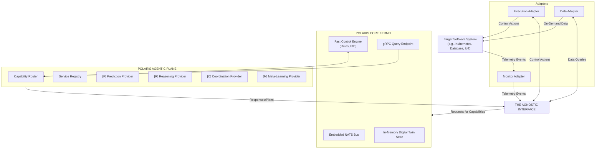
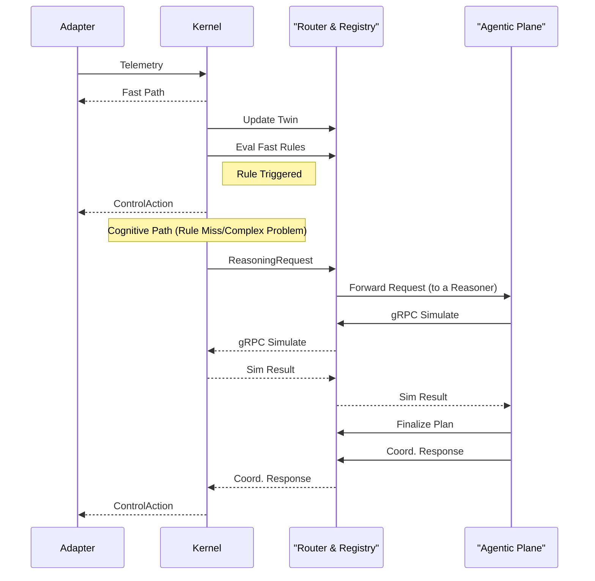
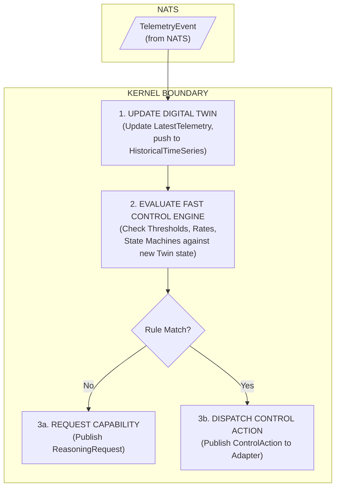
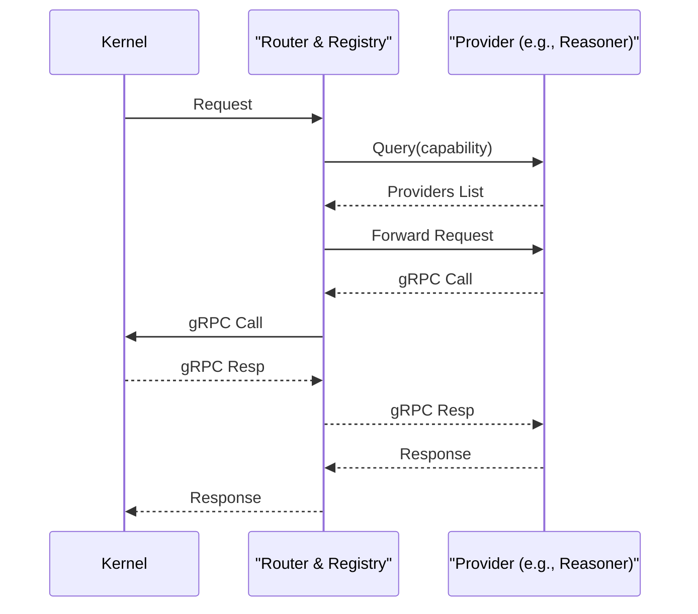
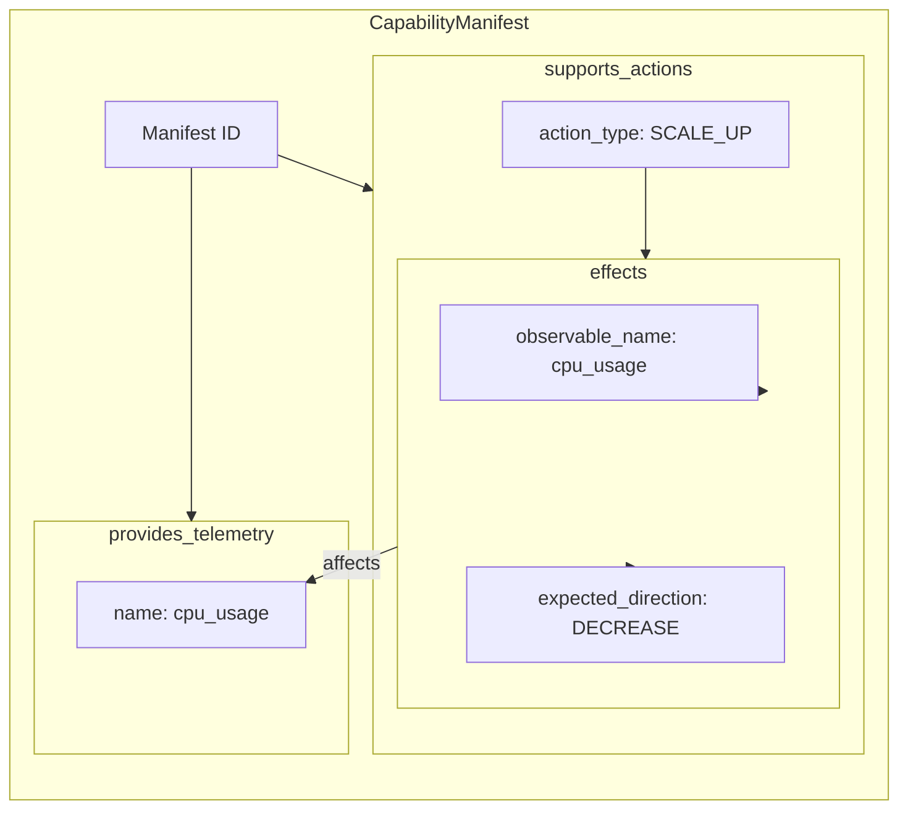

# **POLARIS: The Definitive Architectural Blueprint**

## **Table of Contents**
1.  **Introduction & Vision**
    *   1.1. Core Problem Statement
    *   1.2. The POLARIS Vision: A System with a Nervous System
    *   1.3. The Four Core Design Principles
2.  **Core Architectural Design: The Two-Layered Model**
    *   2.1. Layer 1: The POLARIS Core Kernel (The Brainstem)
    *   2.2. Layer 2: The POLARIS Agentic Plane (The Cerebral Cortex)
    *   2.3. Architectural Overview Diagram
    *   2.4. End-to-End Adaptation Flow (Sequence Diagram)
3.  **The POLARIS Core Kernel: In-Depth**
    *   3.1. Purpose: Real-time Stability and Resilience
    *   3.2. Internal Components & Data Structures
    *   3.3. The Fast Path: The Sub-Millisecond Control Loop Diagram
    *   3.4. gRPC Interface: The Kernel's Secure "Query Engine"
4.  **The POLARIS Agentic Plane: In-Depth**
    *   4.1. Purpose: Advanced, Asynchronous Intelligence
    *   4.2. The Capability-Driven Model & Service-Oriented Design
    *   4.3. Infrastructure: Service Registry & Capability Router
    *   4.4. Cognitive Path Sequence Diagram
    *   4.5. Abstract Capability Definitions & Potential Implementations
5.  **The Agnostic External Interface: The Universal Adapter Contract**
    *   5.1. The Adapter Pattern: Translators for Any System
    *   5.2. The Sensing Interface: A Universal Language for Observation
    *   5.3. The Actuating Interface: A Universal Language for Control
    *   5.4. Linking Actuation to Observation: The `effects` Contract
    *   5.5. The Goal & Constraint Interface: A Dynamic Definition of Success
6.  **Appendix: Formal Schema & Interface Definitions**
    *   6.1. External Interface Schemas (`TelemetryEvent`, `CapabilityManifest`, etc.)
    *   6.2. Internal Capability Schemas (`ReasoningRequest`, `ReasoningResponse`, etc.)
    *   6.3. Core Kernel gRPC Definition (`DigitalTwinQueryService.proto`)
7.  **Implementation Roadmap**

---

## **1. Introduction & Vision**

### **1.1. Core Problem Statement**
Complex software systems require constant oversight to manage performance, cost, and reliability. Traditional automation is reactive, brittle, and lacks the contextual understanding to handle novel problems or optimize for conflicting goals.

### **1.2. The POLARIS Vision: A System with a Nervous System**
POLARIS aims to provide any software system with its own autonomous nervous system. This includes:
*   A **brainstem (The Core Kernel)** for subconscious, real-time reactions to ensure stability and safety.
*   A **cerebral cortex (The Agentic Plane)** for deliberate thought, learning, prediction, and complex problem-solving.
This nervous system is connected to the "body" (the target software) via a universal set of "nerves" (The Agnostic Adapter Interface).

### **1.3. The Four Core Design Principles**
1.  **Separation of Reflex and Reason:** The architecture strictly separates fast, deterministic control (reflex) from slow, complex reasoning. This ensures that a failure in advanced AI components can never compromise the system's core stability.
2.  **Guaranteed Minimal Overhead:** By embedding the message bus and digital twin within a compiled Kernel, the high-frequency control loop operates with near-zero latency, avoiding the overhead of network hops and process serialization.
3.  **Agent-Agnosticism via Capabilities:** The system does not depend on specific agent implementations. It requests abstract capabilities (e.g., `reasoning`), allowing any compliant component to fulfill the role. This makes the system infinitely extensible.
4.  **Universality via Formal Interfaces:** Any software system can integrate with POLARIS as long as it adheres to the formal Adapter contract, making POLARIS a truly universal adaptation framework.

## **2. Core Architectural Design: The Two-Layered Model**

### **2.1. Layer 1: The POLARIS Core Kernel (The Brainstem)**
The Kernel is a single, stateful, high-performance application. It is the bedrock of the system, providing stability-as-a-service. It runs the fastest feedback loops and is designed for 99.999% uptime.

### **2.2. Layer 2: The POLARIS Agentic Plane (The Cerebral Cortex)**
The Agentic Plane is a stateless, distributed collection of microservices that provide cognitive functions. These services can be scaled, updated, and replaced independently without affecting the Kernel. This is where experimentation and advanced AI/ML models live.

### **2.3. Architectural Overview Diagram**

### **2.4. End-to-End Adaptation Flow (Sequence Diagram)**
This diagram illustrates the two primary adaptation paths.

## **3. The POLARIS Core Kernel: In-Depth**

### **3.1. Purpose: Real-time Stability and Resilience**
The Kernel's primary directive is to prevent catastrophic failure and enforce hard safety constraints. It acts as a high-speed, deterministic feedback controller.

### **3.2. Internal Components & Data Structures**
*   **Embedded NATS Server (Go `nats-server` library):** Provides a zero-latency message bus for all internal Kernel communications and serves as the external endpoint for adapters.
*   **In-Memory Digital Twin:** The central "world model."
    *   **Structure:** A concurrent-safe map: `map[SystemID] -> SystemState`
    *   **`SystemState` Object:**
        *   `StaticInfo`: Data from the `CapabilityManifest` (supported actions, effects).
        *   `LatestTelemetry`: A map of the most recent value for each observable (`map[ObservableName] -> TelemetryValue`).
        *   `HistoricalTimeSeries`: In-memory ring buffers of recent time-series data for key metrics, used for rate-of-change calculations.
        *   `DerivedMetrics`: Calculated metrics like moving averages or resource utilization percentages.
        *   `ActiveInvariants`: The current set of hard constraints from the active `GoalConfigurationEvent`.
*   **Fast Control Engine:** A collection of compiled control algorithms.
    *   **Threshold Rules:** `IF cpu.usage > 95% ...`
    *   **Rate-of-Change Rules:** `IF rate(memory.usage_bytes) > 10MB/sec ...`
    *   **State Machine Rules:** `IF readiness_probe_status changes from 'UP' to 'DOWN' 3 times in 5 minutes ...`
*   **gRPC Endpoint:** Exposes a sandboxed, read-only query interface to the Digital Twin.

### **3.3. The Fast Path: The Sub-Millisecond Control Loop Diagram**

### **3.4. gRPC Interface: The Kernel's Secure "Query Engine"**
The `Simulate` gRPC call is the Kernel's front door for the Agentic Plane. When called, the Kernel:
1.  Temporarily forks its in-memory Twin state.
2.  Applies the hypothetical action from the `SimulateRequest`.
3.  Uses the `effects` model from the manifest to predict the state change.
4.  Evaluates the hypothetical new state against the active `invariants`.
5.  Returns a `SimulateResponse` with the predicted utility changes and a boolean `violates_invariants` flag.

## **4. The POLARIS Agentic Plane: In-Depth**

### **4.1. Purpose: Advanced, Asynchronous Intelligence**
The Agentic Plane performs all tasks that require complex modeling, historical data analysis, or non-deterministic reasoning (like interacting with an LLM).

### **4.2. The Capability-Driven Model & Service-Oriented Design**
The Plane operates like a modern microservices application. Services (providers) are independent, scalable, and replaceable. They register their "function signature" (capability) in a shared registry, allowing the system to use them without knowing their internal workings.

### **4.3. Infrastructure: Service Registry & Capability Router**
*   **Service Registry (e.g., Redis):** Acts as the "Yellow Pages" for the Agentic Plane. Stores `CapabilityManifest` documents from all live providers, indexed by capability.
*   **Capability Router:** A smart load balancer. Its primary logic is:
    1.  Receive a generic `Request`.
    2.  Query the Registry for all healthy providers of the requested capability.
    3.  Apply a routing policy (e.g., round-robin, A/B test, cost-based).
    4.  Forward the `Request` to the chosen provider's private input topic.

### **4.4. Cognitive Path Sequence Diagram**
This diagram details the interaction within the Agentic Plane and with the Kernel.

### **4.5. Abstract Capability Definitions & Potential Implementations**
*   **`prediction.time_series`:** Generates forecasts.
    *   *Implementations:* LSTM/GRU models, ARIMA, Facebook Prophet.
*   **`reasoning.conceptual`:** Develops complex plans.
    *   *Implementations:* RAG-enhanced LLMs (GPT-4, Llama), causal inference models, evolutionary algorithms.
*   **`coordination.optimization`:** Selects the best plan.
    *   *Implementations:* Combinatorial auction solver, Pareto front optimizer (NSGA-II).
*   **`learning.meta`:** Adapts goals and policies.
    *   *Implementations:* Bayesian optimization, reinforcement learning (PPO), MAML.

## **5. The Agnostic External Interface: The Universal Adapter Contract**

This is the formal API that decouples POLARIS from the systems it manages.

### **5.1. The Adapter Pattern: Translators for Any System**
Adapters are the essential glue. A `MySQL Adapter` would translate `db.connections.active` into a `TelemetryEvent` and a `RECONFIGURE` action into an `ALTER SYSTEM` command. A `Kubernetes Adapter` would translate pod CPU usage and a `SCALE_COMPUTE` action into a `kubectl` call.

### **5.2. The Sensing Interface: A Universal Language for Observation**
*   **Continuous Push:** `TelemetryEvent` for metrics/events.
*   **On-Demand Pull:** `DataRequest` / `DataResponse` for logs/configs.

### **5.3. The Actuating Interface: A Universal Language for Control**
*   **Declaration:** The `CapabilityManifest` published by the adapter on startup.
*   **Execution:** The `ControlAction` message sent to the adapter.

### **5.4. Linking Actuation to Observation: The `effects` Contract**
The `effects` array within the `CapabilityManifest` is the cornerstone of intelligent adaptation. It creates a formal, machine-readable link between an action and its expected outcome.

**Diagram: The Manifest's Causal Link**

This allows the Digital Twin to run simulations (`If I SCALE_UP, I expect cpu_usage to DECREASE`) and the Meta-Learner to validate them (`When SCALE_UP was performed, did cpu_usage actually DECREASE?`).

### **5.5. The Goal & Constraint Interface: A Dynamic Definition of Success**
The `GoalConfigurationEvent` defines the system's current objectives.
*   **`utility_function`:** A weighted sum of observables. This guides **proactive, multi-objective optimization** in the Agentic Plane. The Reasoner's job is to find a plan that maximizes this utility score.
*   **`invariants`:** Hard thresholds. These are **reactive, safety-critical guardrails** enforced primarily by the Core Kernel. No plan, simulated or real, is allowed to violate an invariant.

## **6. Appendix: Formal Schema & Interface Definitions**
*(This section would contain the full, detailed JSON and Protobuf schemas)*

## **7. Implementation Roadmap**

### **7.1. Phase 1: Build the Core Kernel**
*   **Deliverables:** A stable Go/Rust binary with embedded NATS, the in-memory Twin structure, a basic rule engine, and the external gRPC endpoint.

### **7.2. Phase 2: Build the Agentic Infrastructure**
*   **Deliverables:** The Capability Router and Service Registry microservices. A complete Agent SDK in Python for building external providers.

### **7.3. Phase 3: Populate the Agentic Plane**
*   **Deliverables:** Initial providers for `prediction`, `reasoning`, and `coordination`. The `meta-learning` provider. Adapters for at least two different target systems to prove the agnostic interface. This phase is ongoing.
